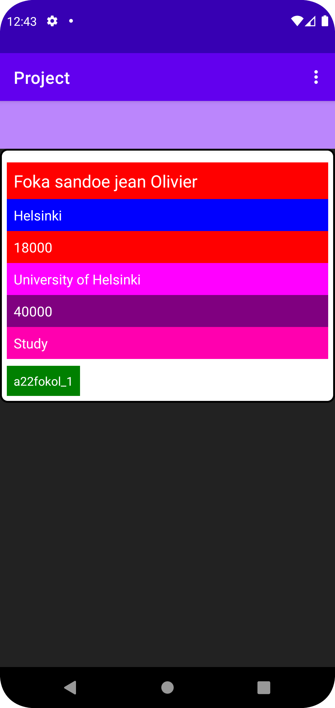
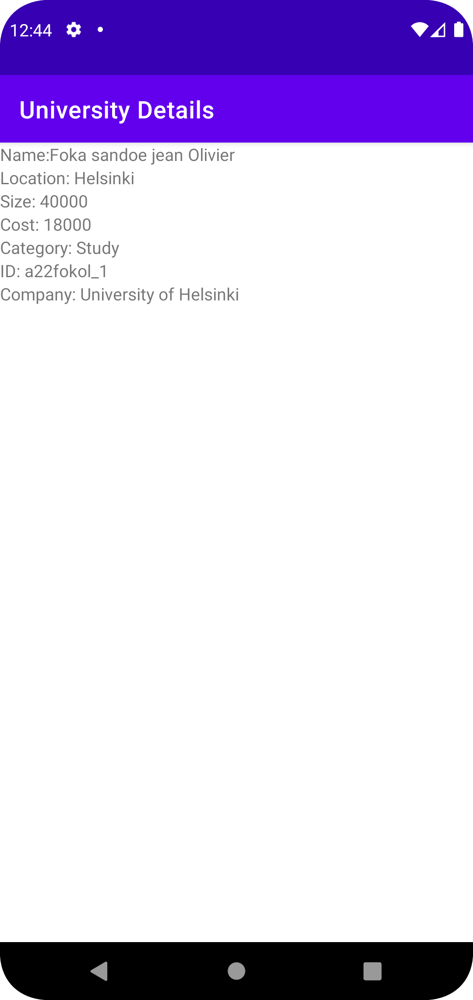

# Rapport

jag har skapat en app om helsinki universitet som har olika variabler som hämtas på min json länk
och visas på min app. jag skapade flera olika classer för att kunna komma fram till det här 
resultatet och men allt fungera bra nu. Jag startade om min project för det gamla project hämatade 
inte data från det Jason länk.

...
private ArrayList<University> parseJson(JSONArray jsonArray) {
ArrayList<University> universityList = new ArrayList<>();

        try {
            JSONObject jsonObject = jsonArray.getJSONObject(0);

            String id = jsonObject.getString("ID");
            String name = jsonObject.getString("name");
            String company = jsonObject.getString("company");
            String location = jsonObject.getString("location");
            String category = jsonObject.getString("category");
            int size = jsonObject.getInt("size");
            int cost = jsonObject.getInt("cost");

            University university = new University(id, name, "", company, location, category, size, cost);
            universityList.add(university);
        } catch (JSONException e) {
            e.printStackTrace();
        }

        return universityList;
    }
...

