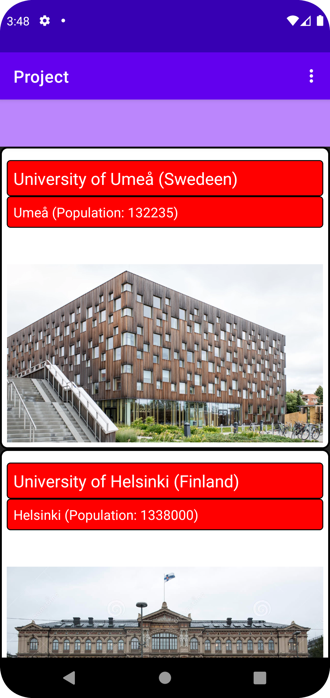

rapport.


Lista över universitet: Denna app listar universitet i Skandinavien. inklusive namnet på universitetet och.
Håll visuellt tilltalande och organiserad.

Universitetsdetaljer: Användare kan se detaljerna för varje universitet som t.ex.
Demografiska och anläggningsdetaljer Applikationen visar också en representativ bild av universitetet.

Webbplatsåtkomst: Denna app ger en direktlänk till den officiella universitetswebbplatsen.
Tillåter användare att hitta mer information om programmet, fakulteten och antagningskrav.

Användarvänligt gränssnitt: Appen har ett rent och lättanvänt gränssnitt. Säkerställer en smidig användarupplevelse.
Experience.Användare kan flytta mellan sektioner. och enkel tillgång till universitetsinformation

Ansökan detaljer:
Appen utvecklades med Android Studio, en populär integrerad utvecklingsmiljö (IDE).
Android applikationsutveckling. Projektet använder flera tekniker och koncept inklusive:


XML för design av UI-layouter
Java programmeringsspråk för att implementera applikationslogik och funktionalitet.
Androids RecyclerView för att lista universiteten på ett rullningsbart och effektivt sätt.
Parsar JSON för att extrahera utbildningsdata från fjärr-API- och modellapplikationsdata.
Picasso-bibliotek för att ladda och visa bilder från webbadresser.


```
        public MyViewHolder(View view) {
            super(view);
            universityName = view.findViewById(R.id.UniversityName);
            universityLocation = view.findViewById(R.id.UniversityLocation);
            universityPopulation = view.findViewById(R.id.UniversityPopulation);
            universityImage = view.findViewById(R.id.UniversityImage);

            view.setOnClickListener(this);
        }

        @Override
        public void onClick(View v) {
            int position = getBindingAdapterPosition();
            if (position != RecyclerView.NO_POSITION) {
                Country university = universityList.get(position);
                listener.onItemClick(university);
            }
        }
    }
}
```



